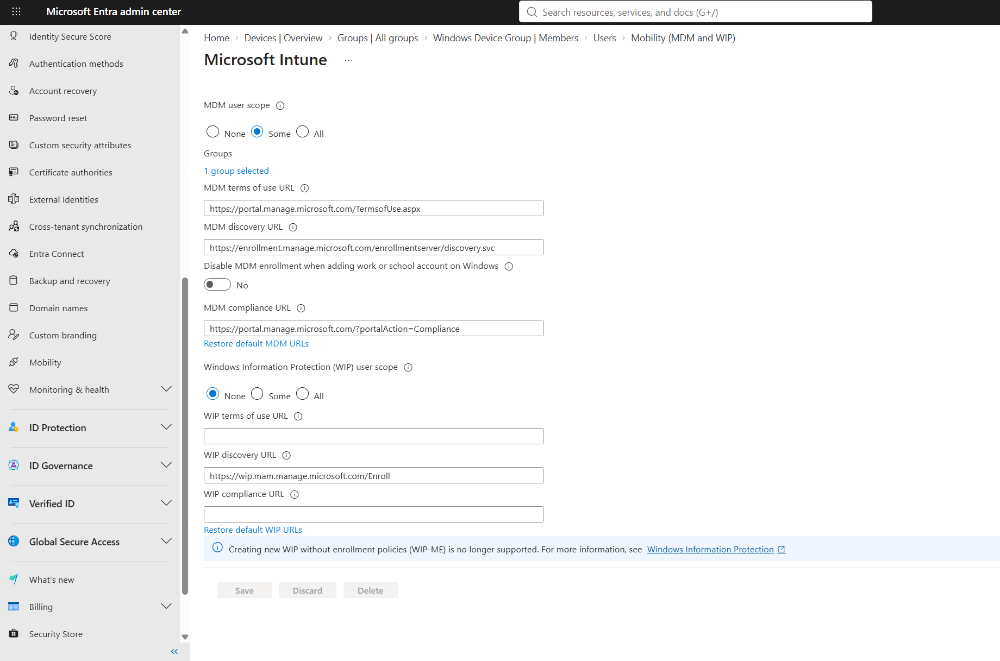
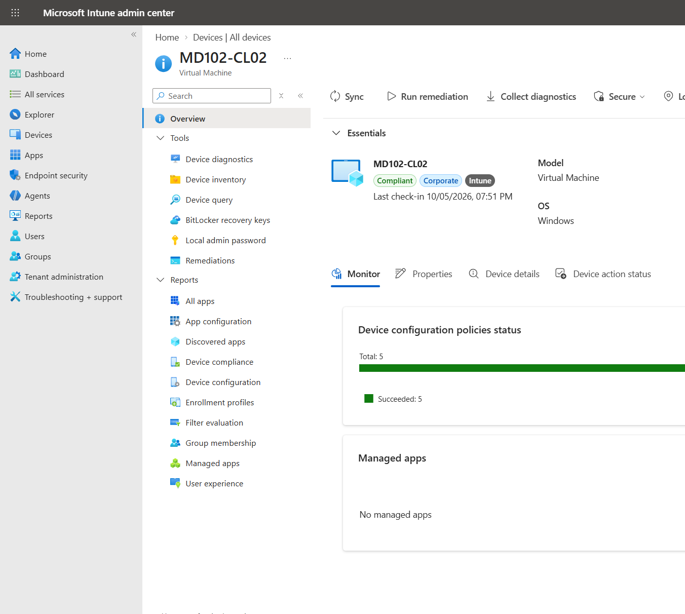

# Lab 03 - Microsoft Intune Enrollment

## Objective

Configure Microsoft Intune automatic enrollment and enroll a Microsoft Entra joined Windows 11 device into Intune.

## Environment

| Component | Configuration |
|---|---|
| Endpoint | MD102-CL02 |
| Operating System | Windows 11 |
| Identity Platform | Microsoft Entra ID |
| Device Join Type | Microsoft Entra joined |
| Device Management | Microsoft Intune |
| Enrollment Method | Automatic MDM enrollment |

---

## 1. Automatic MDM Enrollment

Microsoft Intune automatic enrollment was configured through Microsoft Entra ID.

The MDM user scope was configured for selected users through the `MD102-Intune-Users` group.

This allows targeted users to automatically enroll supported devices into Microsoft Intune when the device is joined to Microsoft Entra ID.



---

## 2. Windows 11 Intune Enrollment

`MD102-CL02` was joined to Microsoft Entra ID and enrolled into Microsoft Intune.

The device is visible in the Intune admin center as:

- Compliant
- Corporate
- Managed by Intune



---

## 3. Enrollment Verification

The device registration and MDM configuration were validated using:

```powershell
dsregcmd /status
```

The device showed:

- `AzureAdJoined : YES`
- `DomainJoined : NO`
- Microsoft Intune MDM URLs
- Microsoft Entra authentication information

This confirmed that the endpoint was Microsoft Entra joined and managed by Microsoft Intune.

---

## Troubleshooting

The device was initially visible in Microsoft Entra ID but was not enrolled into Microsoft Intune.

The cause was that the MDM automatic enrollment scope had been configured after the device was already joined.

The issue was resolved by:

1. Configuring the Intune MDM user scope.
2. Adding the test user to `MD102-Intune-Users`.
3. Rejoining `MD102-CL02` to Microsoft Entra ID.
4. Verifying the resulting Intune enrollment.

---

## Result

The Windows 11 endpoint was successfully enrolled into Microsoft Intune.

The completed configuration includes:

- Microsoft Entra joined Windows 11 endpoint
- Intune automatic enrollment
- MDM user scope targeting
- Successful Intune device enrollment
- Enrollment verification with `dsregcmd /status`

The device is now available for Intune configuration, compliance, security, application, and update management.
