# Lab 04 - Identity and Compliance

## Objective

Implement identity administration, role-based access control, device compliance, Conditional Access, Windows Hello for Business, and Windows LAPS in a Microsoft Endpoint Management lab.

## Environment

| Component | Configuration |

|---|---|

| Identity Platform | Microsoft Entra ID |

| Endpoint Management | Microsoft Intune |

| Managed Endpoint | MD102-CL02 |

| Device Group | Windows Device Group |

| Scope Tag | MD102-Windows-Scope |

## Entra ID Role Assignment

A Microsoft Entra built-in role was assigned to a test user to demonstrate role-based administration.

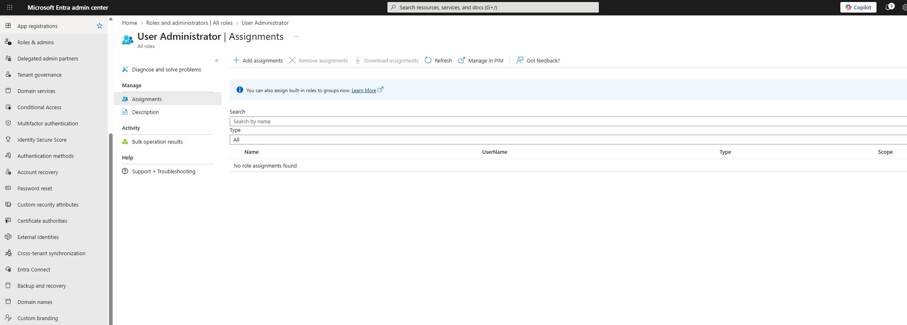

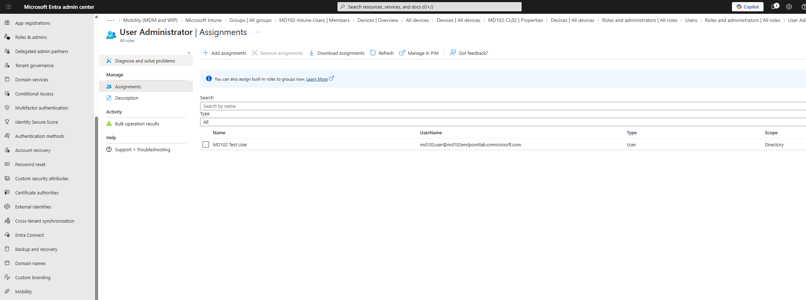

## Intune RBAC

The Intune `Help Desk Operator` role was assigned through a dedicated administrator security group.

The role assignment was scoped to the Windows device group.

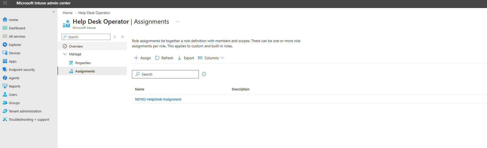

## Scope Tags

A custom scope tag named `MD102-Windows-Scope` was created and applied to support scoped administration.

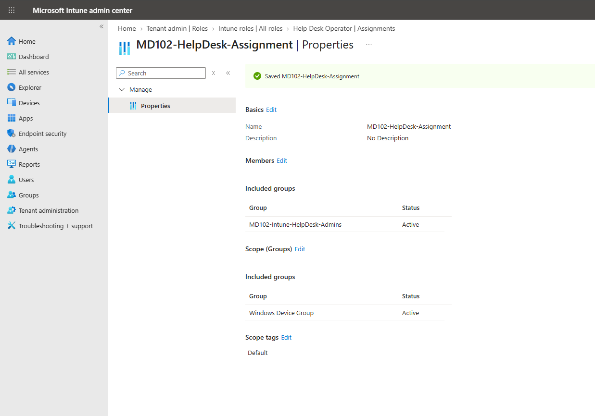

## Device Compliance

A Windows compliance policy named `MD102-Windows-Compliance` was created.

The policy included security requirements such as BitLocker and Secure Boot.

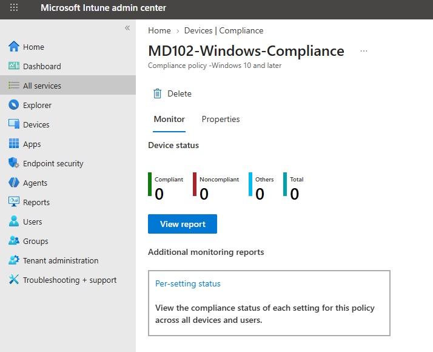

The policy was assigned to `Windows Device Group`.

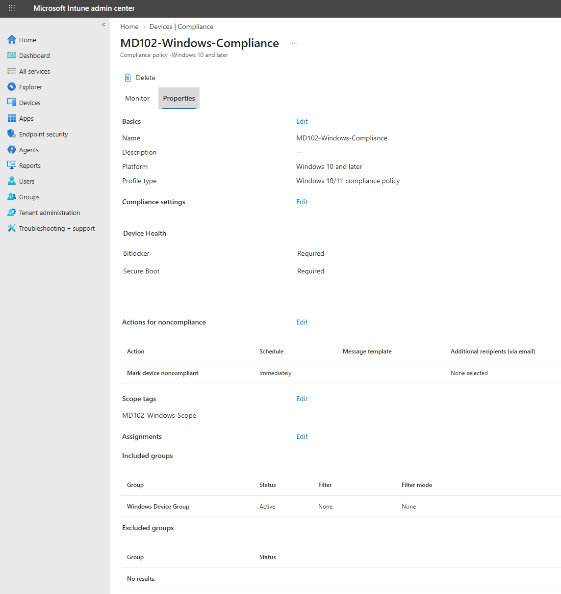

Compliance status was successfully evaluated for `MD102-CL02`.

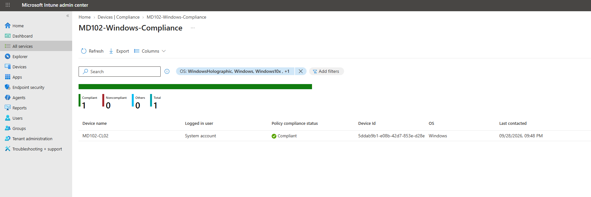

## Conditional Access

A Conditional Access policy named `MD102-Require-Compliant-Windows` was configured.

The policy evaluates Windows sign-ins and requires the device to be marked as compliant.

The policy was initially configured in report-only mode for safe testing.

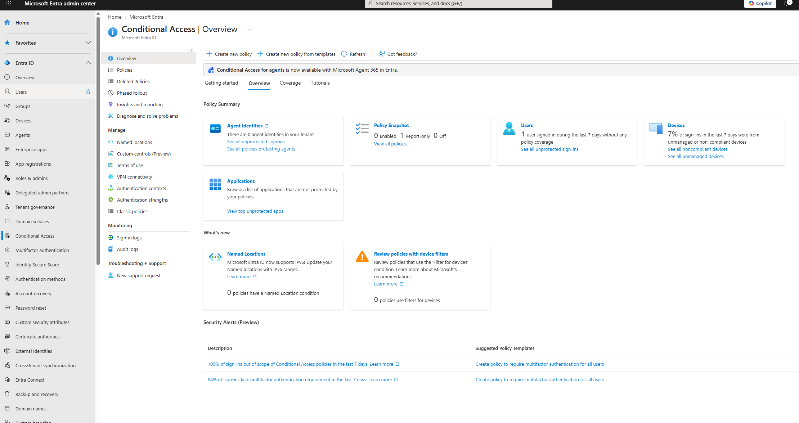

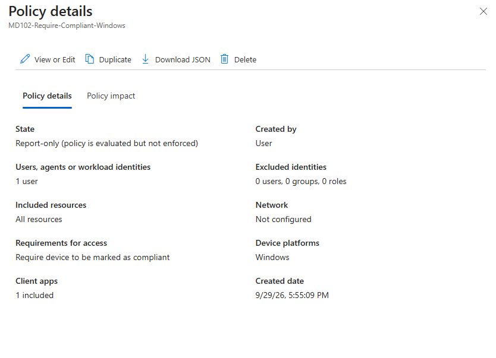

## Windows Hello for Business

A Windows Hello for Business configuration policy was created and assigned to the Windows device group.

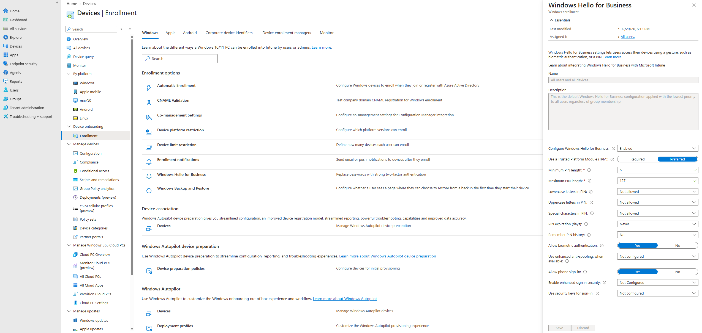

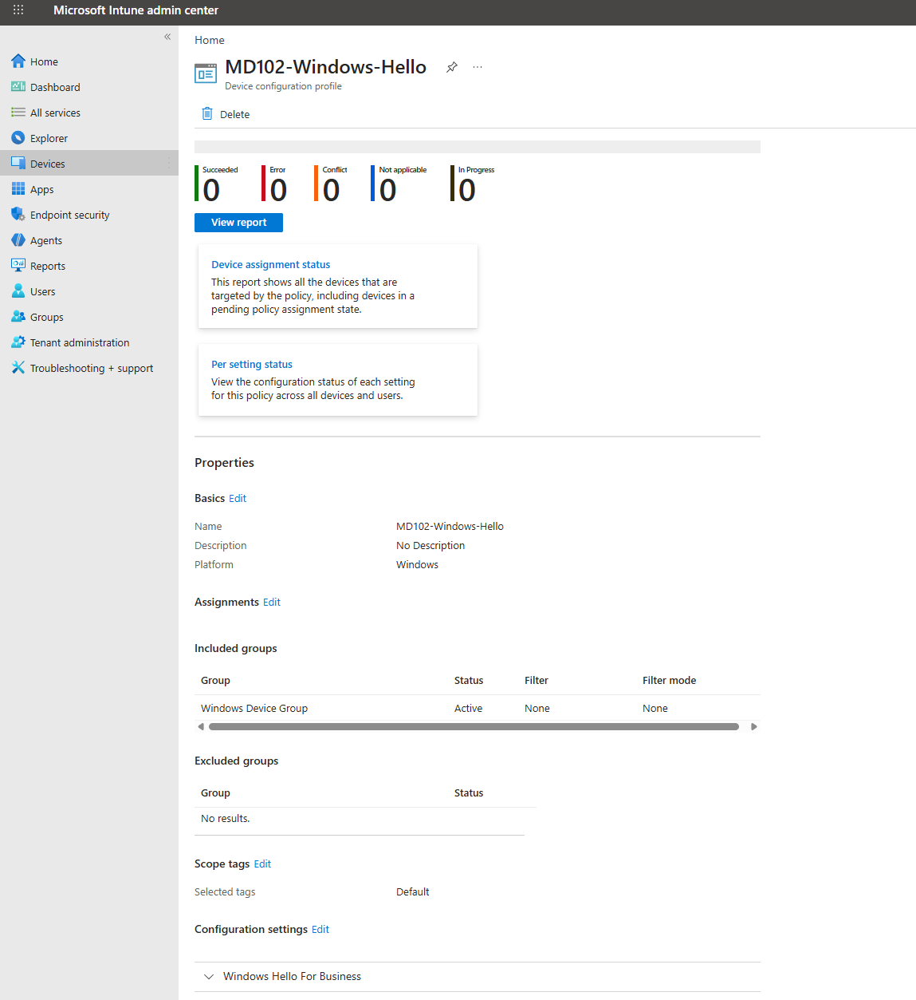

Windows Hello sign-in options were successfully made available on `MD102-CL02`.

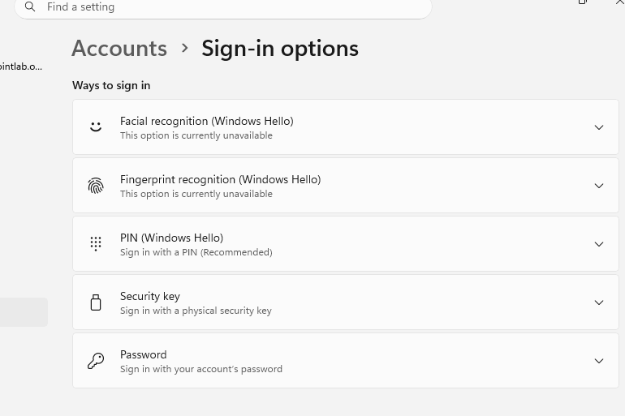

## Windows LAPS

Windows LAPS was enabled for the tenant and configured through Microsoft Intune.

The local administrator password was configured to be backed up to Microsoft Entra ID.

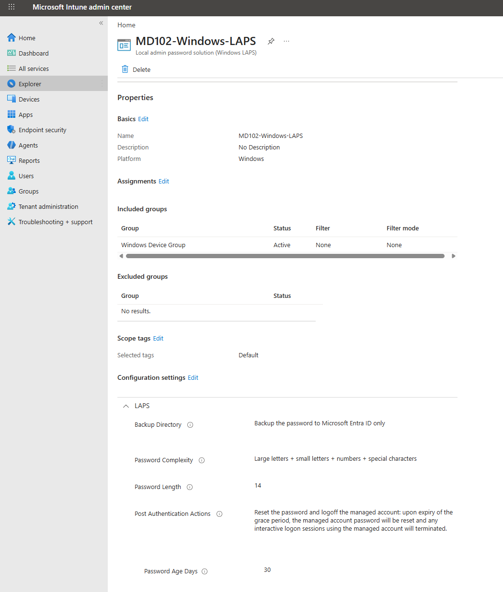

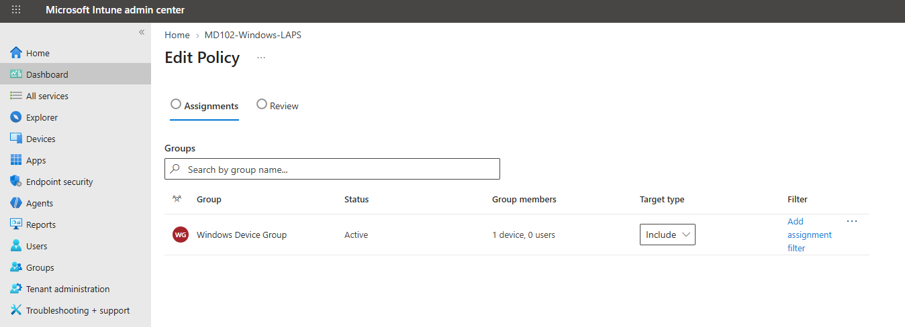

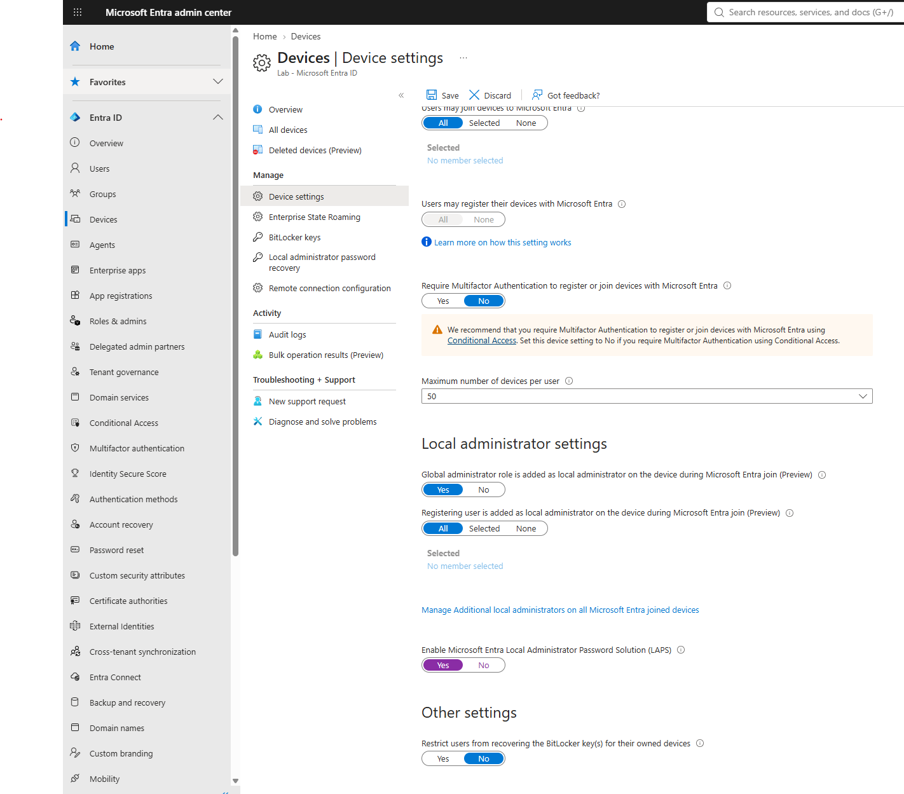

LAPS event logs confirmed successful local password rotation and Microsoft Entra ID backup.

## Result

The following tasks were completed:

- Implemented Microsoft Entra ID RBAC

- Implemented Microsoft Intune RBAC

- Configured scoped administration

- Created and assigned a Windows compliance policy

- Verified device compliance

- Created a Conditional Access policy based on device compliance

- Configured Windows Hello for Business

- Configured Windows LAPS

- Verified LAPS password rotation and Microsoft Entra ID backup

