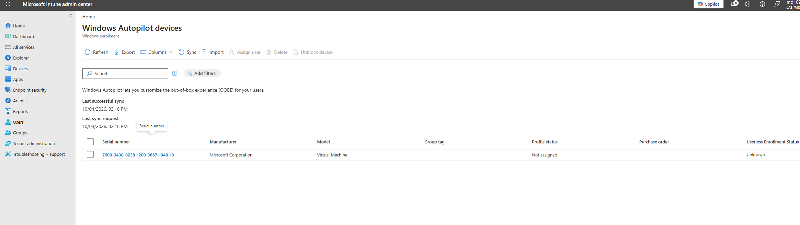
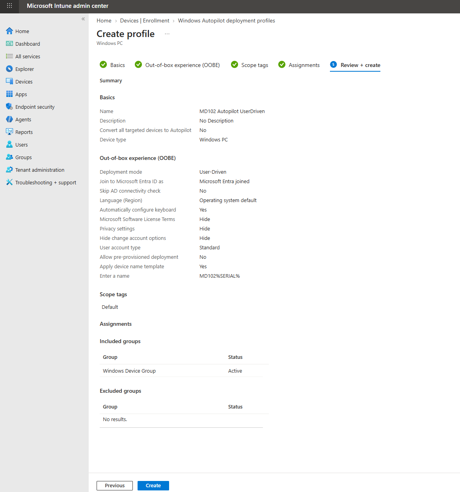
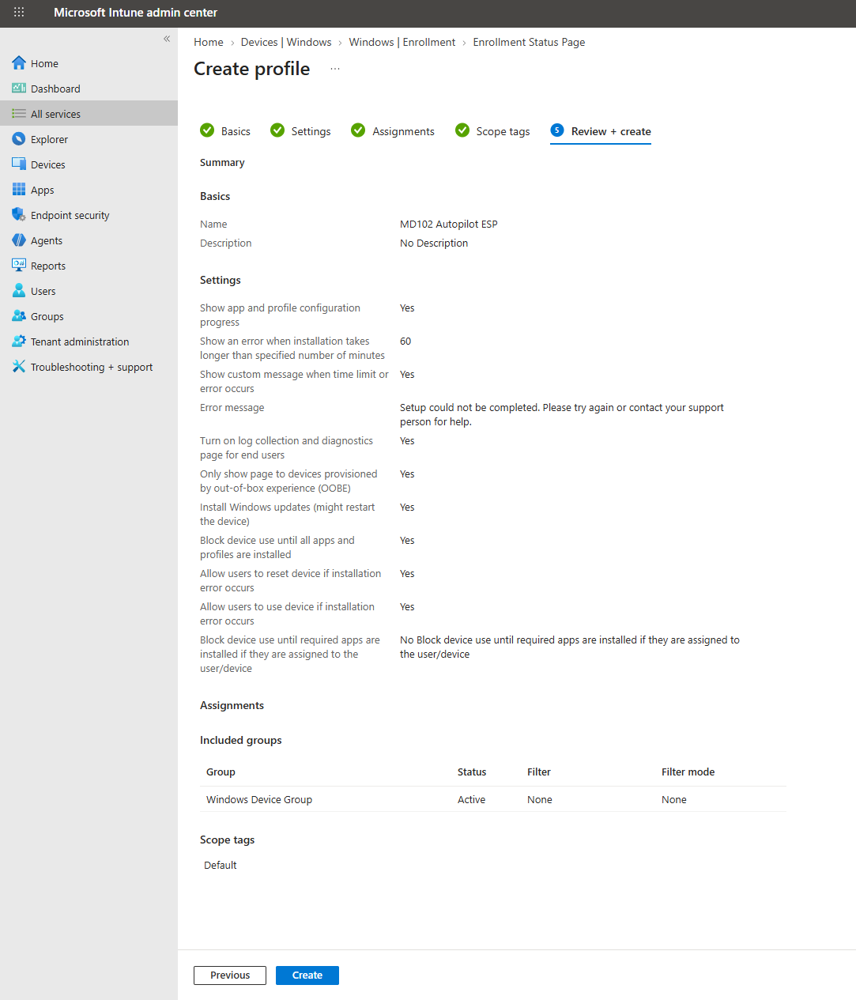
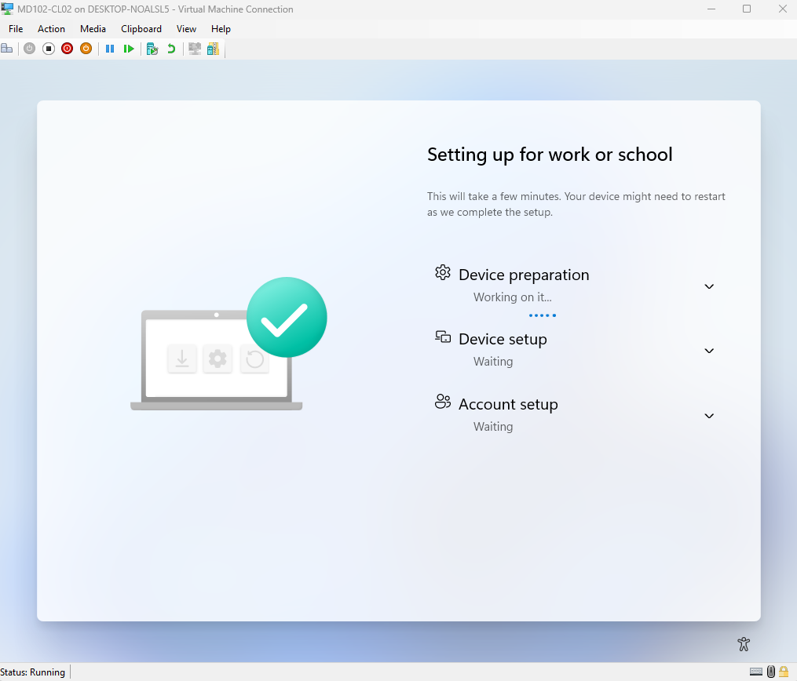

# Lab 05 - Windows Autopilot

## Objective

Register a Windows 11 device with Windows Autopilot, create and assign an Autopilot deployment profile, configure an Enrollment Status Page, and validate an Autopilot deployment through the Windows out-of-box experience.

## Environment

| Component | Configuration |

|---|---|

| Endpoint | MD102-CL02 |

| Management Platform | Microsoft Intune |

| Identity Platform | Microsoft Entra ID |

| Deployment Mode | User-Driven |

| Join Type | Microsoft Entra Joined |

| User Account Type | Standard |

| Deployment Method | Windows Autopilot |

## Autopilot Device Registration

The Windows 11 endpoint was registered with Windows Autopilot by collecting its hardware hash and importing the device information into Microsoft Intune.

The hardware hash CSV was used only for device registration and was not stored in this repository.

## Autopilot Deployment Profile

A user-driven Windows Autopilot deployment profile was created.

The profile was configured with:

- User-driven deployment

- Microsoft Entra join

- Standard user account

- Hidden Microsoft Software License Terms

- Hidden privacy settings

- Automatic keyboard configuration

- Automatic device naming using `MD102%SERIAL%`

## Enrollment Status Page

An Enrollment Status Page was configured to monitor device preparation and setup during Autopilot deployment.

The ESP provides visibility into:

- Device preparation

- Device setup

- Account setup

- Policy processing

- Application installation

## Autopilot Deployment

The Windows 11 endpoint was reset and returned to the out-of-box experience.

Because the device was registered with Windows Autopilot and targeted by the deployment profile, the device automatically entered the organization-managed setup flow.

The Enrollment Status Page successfully displayed the device preparation, device setup, and account setup stages.

## Troubleshooting Notes

During the lab, the following considerations were reviewed:

- PowerShell execution policy temporarily blocked the Autopilot hardware hash script

- The execution policy was bypassed only for the active PowerShell process

- Autopilot device synchronization required time before the imported device appeared in the portal

- Hardware hash data was not committed to GitHub

## Result

The following tasks were completed:

- Collected a Windows Autopilot hardware hash

- Registered a Windows device with Windows Autopilot

- Created a user-driven Autopilot deployment profile

- Configured Microsoft Entra join

- Configured standard user provisioning

- Configured an Enrollment Status Page

- Reset the Windows endpoint to OOBE

- Successfully validated the Windows Autopilot deployment workflow

