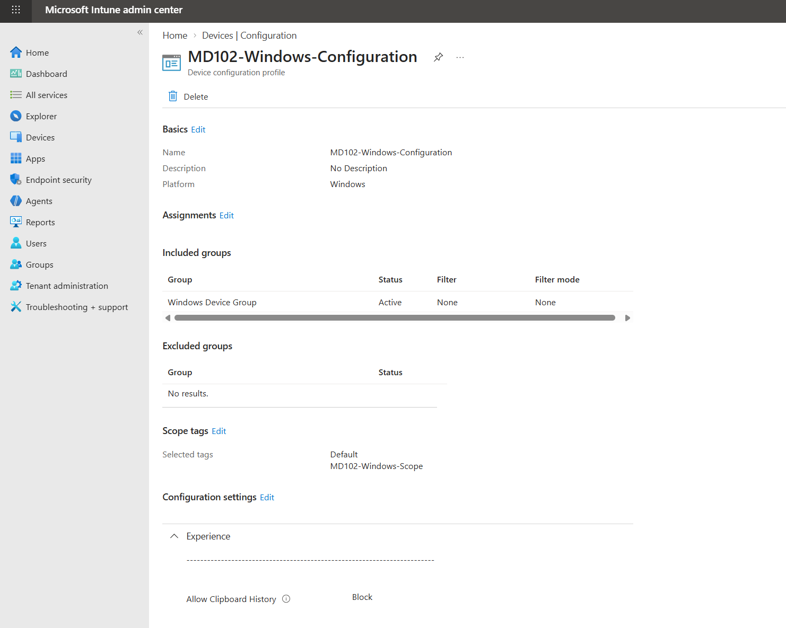
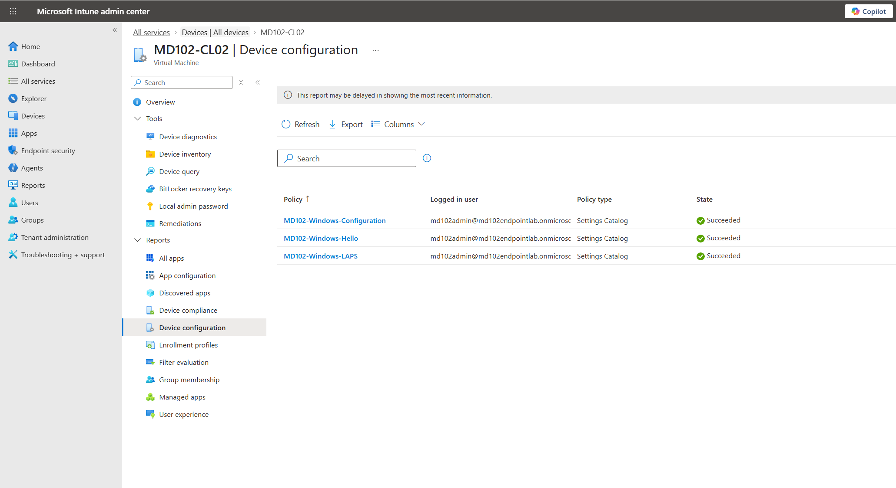
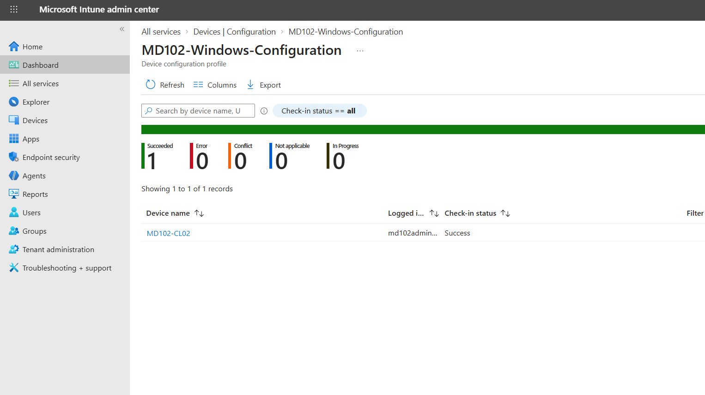
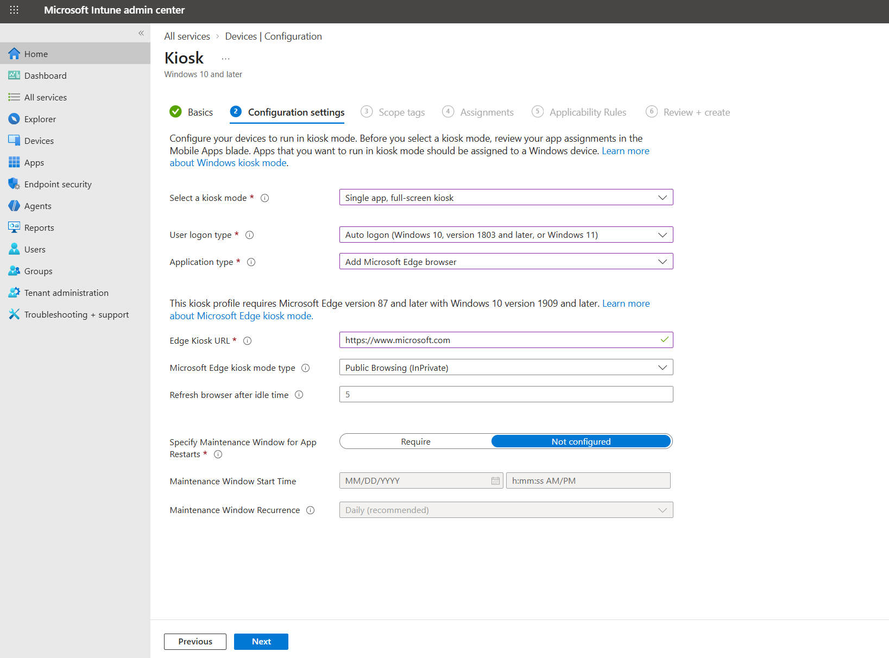
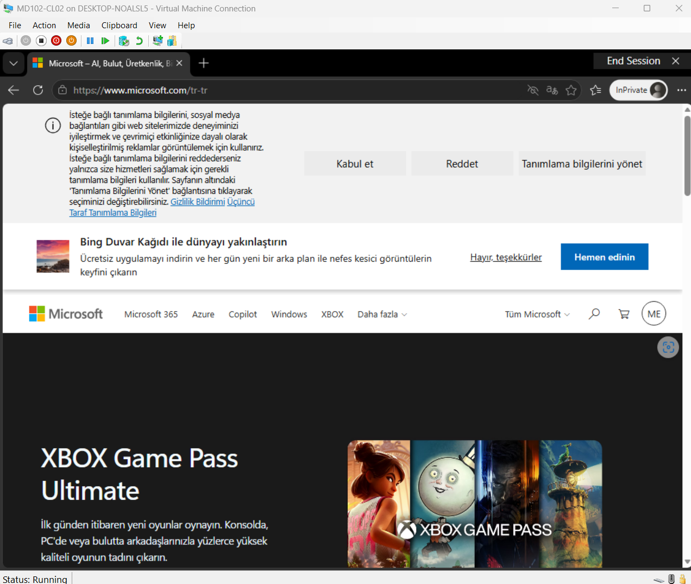

# Lab 06 - Device Configuration

## Objective

Implement and validate Windows device configuration profiles using Microsoft Intune.

This lab focused on configuration profile deployment, monitoring, and Windows kiosk mode.

## Environment

| Component | Configuration |

|---|---|

| Endpoint | MD102-CL02 |

| Management Platform | Microsoft Intune |

| Operating System | Windows 11 |

| Target Group | Windows Device Group |

## Windows Configuration Profile

A Windows Settings Catalog profile named `MD102-Windows-Configuration` was created.

The policy was configured to disable Windows Clipboard History.

The profile was assigned to the `Windows Device Group`.

## Configuration Profile Validation

The policy was synchronized with `MD102-CL02` and successfully processed by Microsoft Intune.

The device configuration status was verified from the Intune admin center.

## Configuration Profile Monitoring

Configuration profile monitoring was reviewed using device and per-setting status information.

This allows administrators to identify:

- Successful deployments

- Errors

- Conflicts

- Pending configurations

- Per-setting deployment status

## Windows Kiosk Mode

A single-app full-screen kiosk profile was created using Microsoft Intune.

The profile was configured to:

- Automatically sign in using the kiosk account

- Launch Microsoft Edge

- Open a predefined website

- Use Public Browsing (InPrivate) mode

- Restrict the device to a dedicated kiosk experience

Kiosk mode can be used for dedicated-purpose devices such as self-service terminals, information displays, and shared browsing stations.

The kiosk policy was temporarily assigned to the Windows device group and tested on `MD102-CL02`.

The device successfully signed in to the kiosk account and automatically launched Microsoft Edge in kiosk mode.

After validation, the kiosk assignment was removed to return the endpoint to normal lab use.

## Android and iOS Configuration Profiles

Android and iOS configuration profile concepts were reviewed as part of the MD-102 training.

No Android or iOS endpoint was deployed in this lab environment.

## Result

The following tasks were completed:

- Created a Windows Settings Catalog configuration profile

- Assigned a configuration profile to a Windows device group

- Verified successful policy deployment

- Monitored configuration profile status

- Created a Windows single-app kiosk profile

- Successfully validated Microsoft Edge kiosk mode on a Windows endpoint

- Reviewed Android and iOS device configuration concepts

