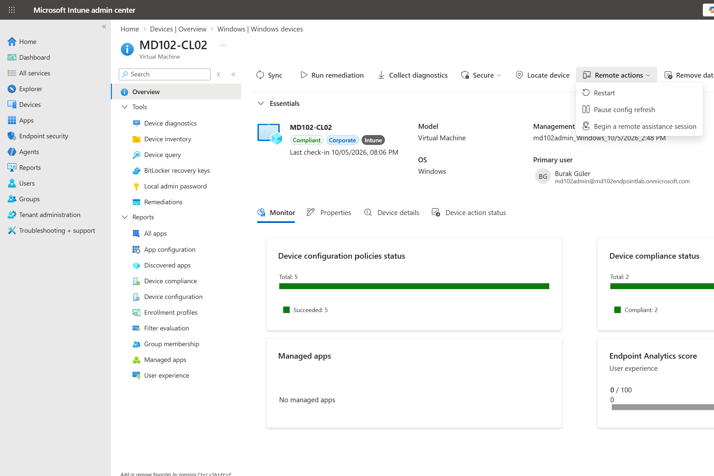
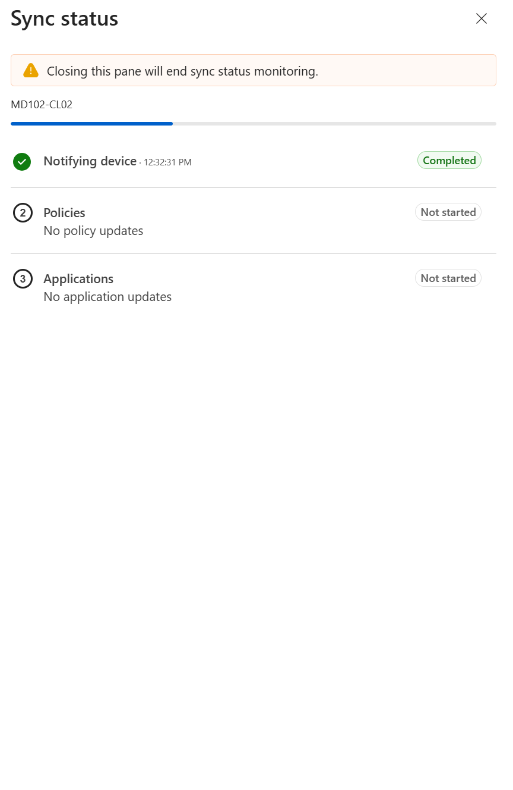
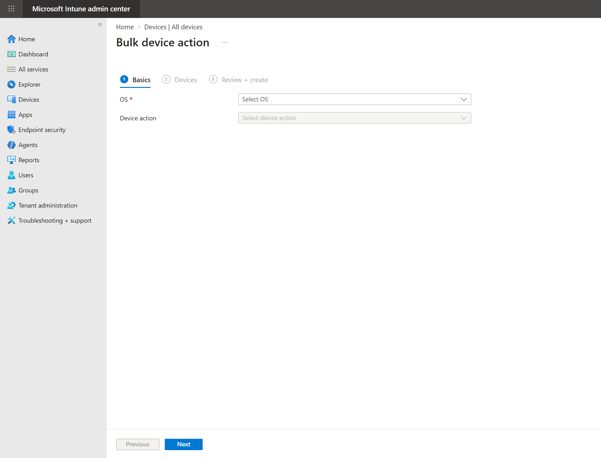
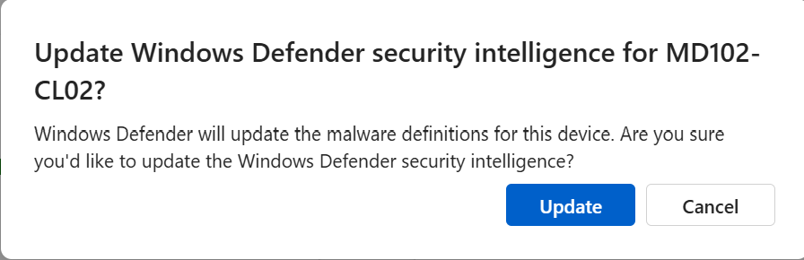
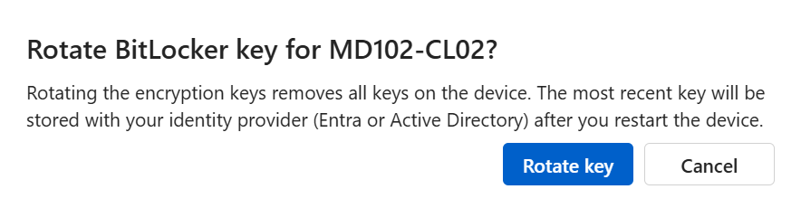
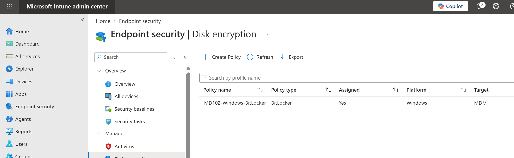
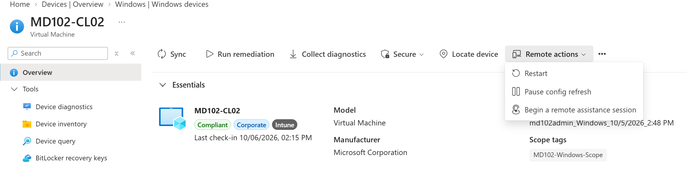

# Lab 08 - Remote Device Management

## Objective

Perform and review remote device management actions in Microsoft Intune using the Windows 11 endpoint `MD102-CL02`.

## Environment

| Component | Configuration |
|---|---|
| Endpoint | MD102-CL02 |
| Operating System | Windows 11 |
| Management Platform | Microsoft Intune |
| Identity Platform | Microsoft Entra ID |
| Device State | Corporate / Intune managed |

---

## 1. Remote Device Actions

Microsoft Intune provides remote actions that can be initiated from the device management console.

Available actions include:

- Sync
- Restart
- Retire
- Wipe
- Defender security intelligence update
- BitLocker recovery key rotation

Destructive actions such as Retire and Wipe were reviewed but were not executed to preserve the lab environment.

---

## 2. Device Sync

A remote Sync action was triggered for `MD102-CL02`.

This forces the endpoint to contact Microsoft Intune and retrieve current policies, configurations, and management instructions.

---

## 3. Bulk Device Actions

The Intune Bulk Device Action interface was reviewed.

Bulk actions allow administrators to perform supported management actions against multiple managed endpoints from a single workflow.

---

## 4. Microsoft Defender Security Intelligence

A Microsoft Defender security intelligence update was remotely triggered for `MD102-CL02`.

This action requests the managed endpoint to update its Microsoft Defender security intelligence definitions.

---

## 5. BitLocker Recovery Key Management

The BitLocker recovery key rotation remote action was reviewed and triggered.

During validation, the endpoint was found to have an encrypted operating system volume without active BitLocker protection and without an available recovery key in Intune.

A BitLocker disk encryption policy named `MD102-Windows-BitLocker` was therefore created and assigned to the Windows device group.

The recovery key rotation workflow was explored, but successful recovery key rotation was not fully validated in this lab.

---

## 6. Device Query with KQL

Microsoft Intune Device Query was reviewed.

Supported device inventory entities such as `OsVersion`, `Cpu`, `DiskDrive`, and `EncryptableVolume` were available in the query interface.

A real-time KQL query was attempted against `MD102-CL02`, but the query returned a service or prerequisite error.

The feature was therefore reviewed but not successfully validated in the current lab environment.

---

## 7. Remote Restart

A remote Restart action was triggered from Microsoft Intune against `MD102-CL02`.

The endpoint successfully received the remote management action and restarted.

---

## Result

The following Intune remote management capabilities were completed or reviewed:

- Triggered a device Sync
- Reviewed bulk device actions
- Triggered Microsoft Defender security intelligence update
- Reviewed BitLocker recovery key rotation
- Created and assigned a BitLocker disk encryption policy
- Reviewed Intune Device Query and KQL capabilities
- Triggered a remote Windows restart
- Reviewed Retire and Wipe without executing destructive actions

This lab demonstrated common remote endpoint administration workflows available through Microsoft Intune.

