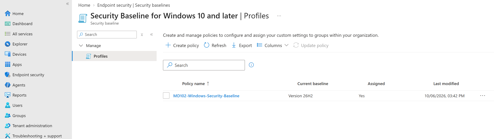
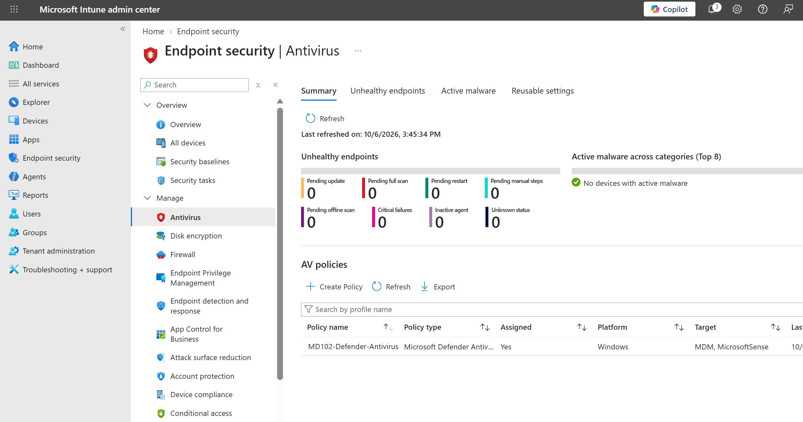
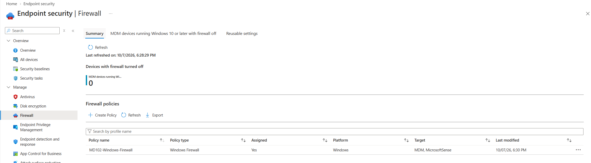
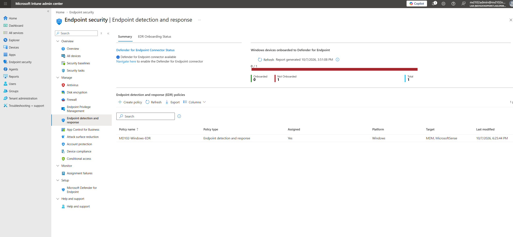
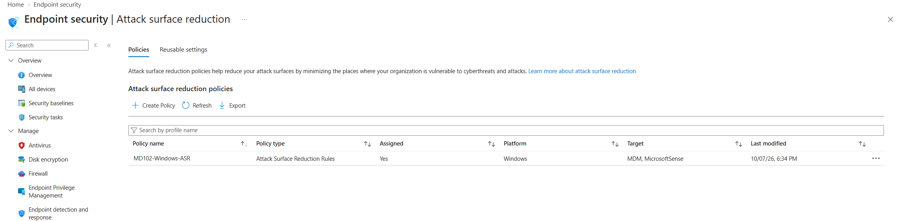
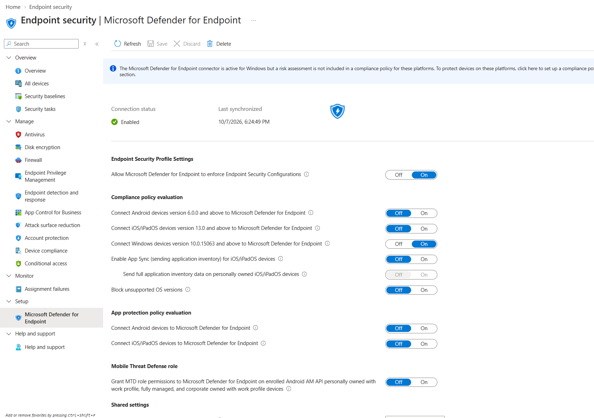
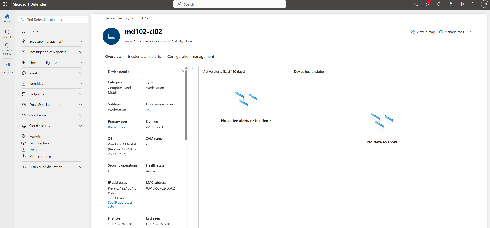

# Lab 09 - Endpoint Security

## Objective

Configure and validate Microsoft Intune endpoint security capabilities for a managed Windows 11 device.

This lab covers security baselines, Microsoft Defender Antivirus, Windows Firewall, Endpoint Detection and Response, Attack Surface Reduction, and Microsoft Defender for Endpoint integration.

## Environment

| Component | Configuration |
|---|---|
| Endpoint | MD102-CL02 |
| Operating System | Windows 11 |
| Management Platform | Microsoft Intune |
| Security Platform | Microsoft Defender for Endpoint |
| Target Group | Windows Device Group |

---

## 1. Windows Security Baseline

A Windows security baseline named `MD102-Windows-Security-Baseline` was created in Microsoft Intune.

The baseline was assigned to the `Windows Device Group`.

Security baselines provide Microsoft-recommended security settings that can be centrally applied to managed Windows devices.

---

## 2. Microsoft Defender Antivirus

An endpoint security Antivirus policy was created to manage Microsoft Defender Antivirus settings.

The policy included security controls such as:

- Real-time monitoring
- Behavior monitoring
- Cloud protection
- Downloaded file and attachment scanning
- Script scanning
- Network protection
- Potentially unwanted application protection
- On-access protection

The policy was assigned to the `Windows Device Group`.

---

## 3. Microsoft Defender Firewall

A Microsoft Defender Firewall policy was created for managed Windows endpoints.

The configuration enabled firewall protection for:

- Domain networks
- Private networks
- Public networks

Inbound connections were configured to use a restrictive security posture while outbound traffic remained allowed by default.

The policy was assigned to the `Windows Device Group`.

---

## 4. Endpoint Detection and Response

An Endpoint Detection and Response policy named `MD102-Windows-EDR` was created.

The policy was configured to onboard managed Windows devices to Microsoft Defender for Endpoint.

The policy was assigned to the `Windows Device Group`.

---

## 5. Attack Surface Reduction

An Attack Surface Reduction policy named `MD102-Windows-ASR` was created.

Selected ASR rules were configured in Audit mode to evaluate potentially risky application behavior without immediately blocking activity.

The configured rules included controls for:

- Credential stealing from LSASS
- Office child process creation
- Office executable content creation
- Executable content from email and webmail
- JavaScript and VBScript launching downloaded executables
- Vulnerable signed driver abuse
- WMI event subscription persistence

The policy was assigned to the `Windows Device Group`.

---

## 6. Microsoft Defender for Endpoint Integration

Microsoft Intune was connected to Microsoft Defender for Endpoint.

Windows device integration was enabled to allow managed endpoints to participate in Microsoft Defender for Endpoint security workflows.

---

## 7. Defender for Endpoint Onboarding Validation

`MD102-CL02` was successfully onboarded to Microsoft Defender for Endpoint.

The device appeared in the Microsoft Defender Device Inventory with an active health state.

This confirmed successful integration between:

- Microsoft Intune
- Microsoft Defender for Endpoint
- The managed Windows 11 endpoint

---

## Result

The following endpoint security capabilities were implemented and validated:

- Windows Security Baseline
- Microsoft Defender Antivirus policy
- Microsoft Defender Firewall policy
- Endpoint Detection and Response policy
- Attack Surface Reduction policy
- Microsoft Defender for Endpoint integration
- Successful onboarding of `MD102-CL02`
- Defender device health validation

This lab demonstrates centralized endpoint security configuration and monitoring using Microsoft Intune and Microsoft Defender for Endpoint.
