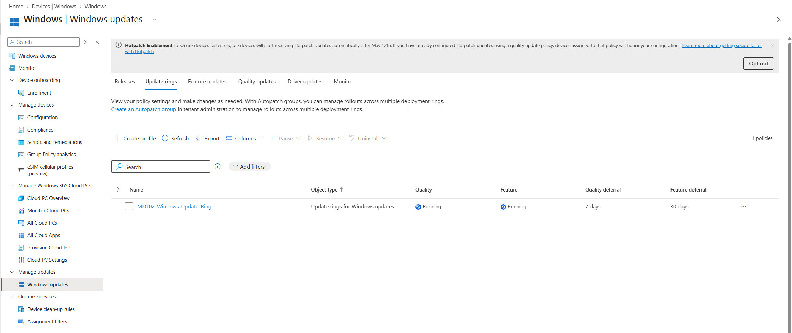
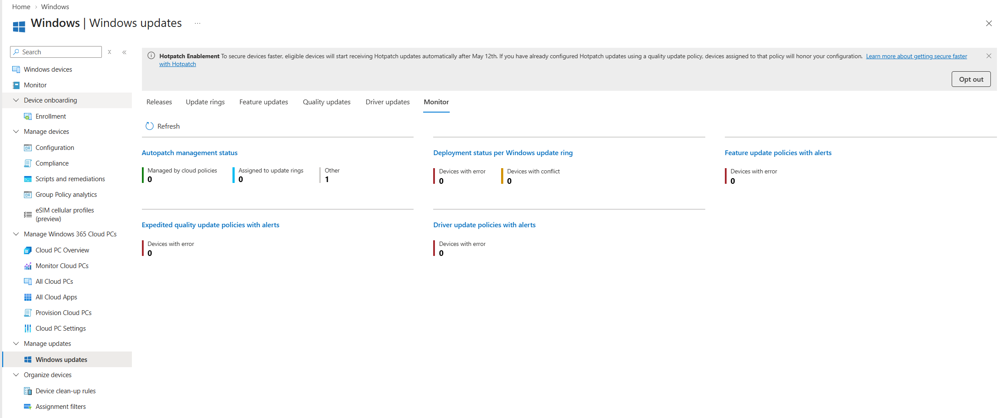
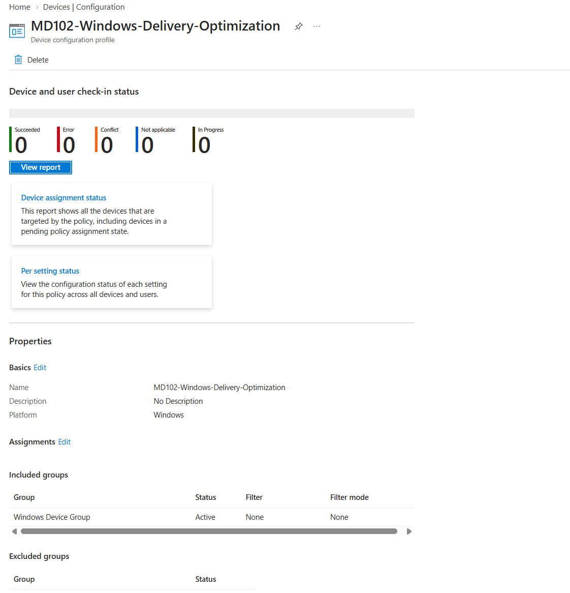

# Lab 10 - Update Management

## Objective

Configure and validate Windows update management capabilities in Microsoft Intune.

This lab covers Windows Update rings, update monitoring, troubleshooting concepts, Delivery Optimization, and an overview of update management for Android, iOS, iPadOS, and macOS.

## Environment

| Component | Configuration |
|---|---|
| Endpoint | MD102-CL02 |
| Operating System | Windows 11 |
| Management Platform | Microsoft Intune |
| Target Group | Windows Device Group |

---

## 1. Windows Update Ring

A Windows Update Ring named `MD102-Windows-Update-Ring` was created in Microsoft Intune.

The policy was assigned to the `Windows Device Group`.

The update ring was configured with the following settings:

- Microsoft product updates allowed
- Windows driver updates allowed
- Quality update deferral: 7 days
- Feature update deferral: 30 days
- Automatic Windows 10 to Windows 11 upgrade disabled
- Feature update uninstall period: 10 days
- Pre-release builds not configured
- Active hours: 08:00 - 17:00
- Users prevented from pausing Windows updates
- Windows Update notifications enabled
- Feature update deadline: 7 days
- Quality update deadline: 2 days
- Grace period: 2 days
- Automatic reboot before deadline disabled

This configuration provides a controlled update deployment strategy while still allowing security and quality updates to reach managed devices.

---

## 2. Update Monitoring

The Windows Update monitoring dashboard was reviewed in Microsoft Intune.

The monitoring interface provides visibility into:

- Update ring deployment status
- Devices with errors
- Devices with policy conflicts
- Feature update alerts
- Quality update alerts
- Driver update alerts

This allows administrators to identify update deployment issues and investigate affected endpoints.

---

## 3. Update Troubleshooting

Windows update troubleshooting capabilities in Intune were reviewed.

Common deployment states include:

- Succeeded
- Pending
- Error
- Conflict

When a device reports an error, administrators can review device status, last check-in information, update policy status, and related error codes.

Policy conflicts can also be investigated when multiple update policies target the same endpoint.

---

## 4. Android Update Management

Android operating system update management was reviewed conceptually.

Microsoft Intune can control supported Android update behaviors through device configuration profiles and platform-specific management settings.

A physical Android device was not available in this lab, so no Android update policy was deployed.

---

## 5. Apple Update Management

Update management for iOS, iPadOS, and macOS was reviewed conceptually.

Microsoft Intune can be used to configure update behavior, update deferrals, and deployment policies for supported Apple platforms.

Apple devices were not available in the current lab environment, so these configurations were not deployed.

---

## 6. Delivery Optimization

A Delivery Optimization policy named `MD102-Windows-Delivery-Optimization` was created.

The policy was assigned to the `Windows Device Group`.

Delivery Optimization was configured to allow peer-to-peer content sharing between devices on the same local network.

This can reduce external network bandwidth consumption by allowing Windows devices to share Microsoft update content locally.

---

## Result

The following update management capabilities were implemented or reviewed:

- Created a Windows Update Ring
- Configured quality and feature update deferrals
- Configured active hours and update deadlines
- Assigned update policies to managed Windows devices
- Reviewed Windows Update monitoring
- Reviewed update troubleshooting workflows
- Reviewed Android update management
- Reviewed iOS, iPadOS, and macOS update management
- Created a Delivery Optimization policy
- Configured local peer-to-peer update delivery

This lab demonstrates centralized Windows update management using Microsoft Intune.
