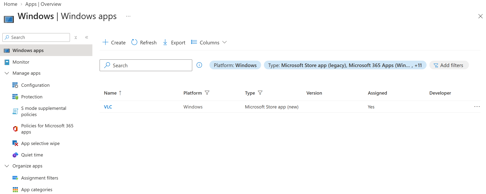
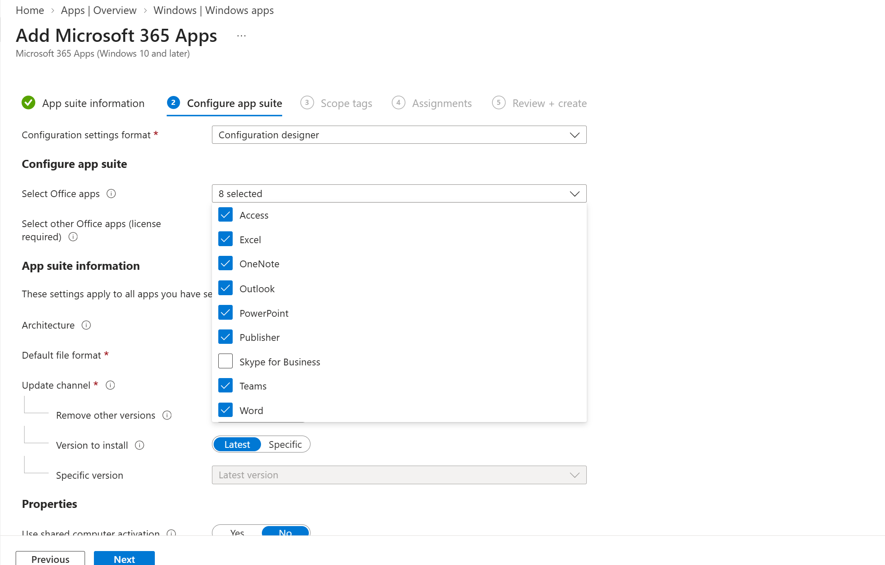
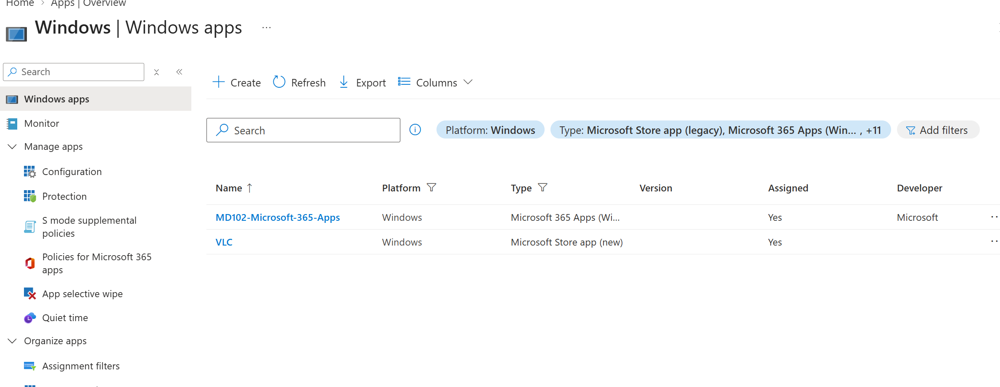
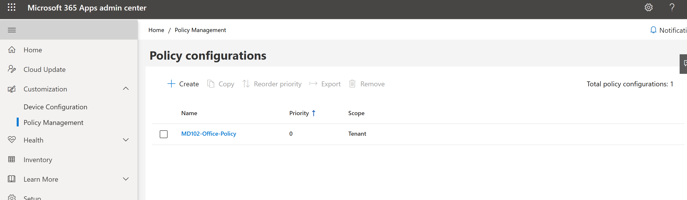

# Lab 11 - Application Management

## Objective

Configure and manage application deployment using Microsoft Intune.

This lab covers Microsoft Store app deployment, Microsoft 365 Apps deployment, Office policy management, and an overview of Office deployment and application store management.

## Environment

| Component | Configuration |
|---|---|
| Endpoint | MD102-CL02 |
| Operating System | Windows 11 |
| Management Platform | Microsoft Intune |
| Target Group | Windows Device Group |

---

## 1. Microsoft Store App Deployment

A Microsoft Store application was added to Microsoft Intune.

VLC was selected from the Microsoft Store catalog and assigned to the `Windows Device Group` as a required application.

This configuration allows Microsoft Intune to automatically deploy the application to targeted managed Windows devices.

---

## 2. Microsoft 365 Apps Configuration

A Microsoft 365 Apps deployment was created in Microsoft Intune.

The deployment was configured for managed Windows devices and included core Microsoft 365 applications such as:

- Microsoft Word
- Microsoft Excel
- Microsoft PowerPoint
- Microsoft Outlook
- Microsoft OneNote

The configuration used the 64-bit Microsoft 365 Apps architecture and was prepared for deployment to the `Windows Device Group`.

---

## 3. Microsoft 365 Apps Deployment

The Microsoft 365 Apps deployment was assigned to the `Windows Device Group` as a required application.

This configuration allows Microsoft Intune to install the selected Microsoft 365 applications automatically on targeted Windows devices.

---

## 4. Office Deployment Tools

The Microsoft Office Deployment Tool and Office Customization Tool were reviewed.

These tools can be used to:

- Customize Microsoft 365 Apps installations
- Select Office applications
- Configure update channels
- Define installation architecture
- Generate deployment configuration files
- Support enterprise software deployment scenarios

No separate Office Deployment Tool package was deployed in this lab because Microsoft 365 Apps deployment was configured directly through Microsoft Intune.

---

## 5. Microsoft 365 Apps Cloud Policy

Microsoft 365 Apps Cloud Policy was configured through the Microsoft 365 Apps admin center.

Selected Office policy settings were configured to improve security and application management.

The configuration included settings such as:

- Blocking macros from running in Office files from the Internet
- Managing Office first-run behavior
- Managing Microsoft 365 Apps update behavior

---

## 6. Platform-Specific Application Stores

Application deployment through platform-specific app stores was reviewed.

The Microsoft Store (new) integration was used to deploy VLC to Windows devices.

This approach allows administrators to deploy supported Store applications without manually packaging Win32 installation files.

---

## Result

The following application management capabilities were implemented or reviewed:

- Added and assigned VLC through Microsoft Store (new)
- Configured VLC as a required application
- Created a Microsoft 365 Apps configuration
- Assigned Microsoft 365 Apps to managed Windows devices
- Reviewed Office Deployment Tool and Office Customization Tool
- Configured Microsoft 365 Apps Cloud Policy
- Reviewed platform-specific application store deployment

Application installation status on `MD102-CL02` will be validated after the endpoint has suitable network connectivity.

This lab demonstrates centralized application deployment and Office management using Microsoft Intune.
