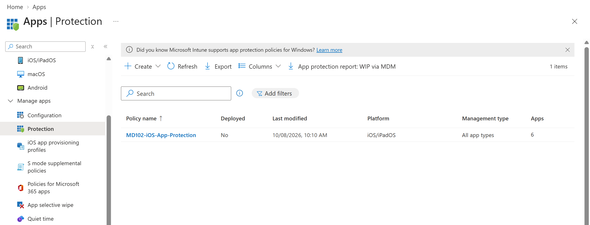
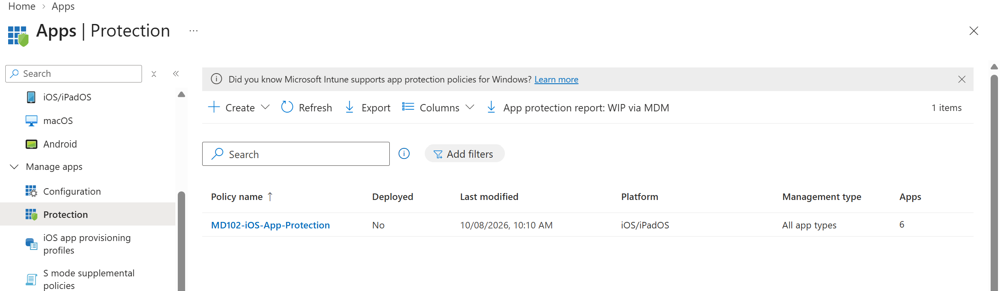
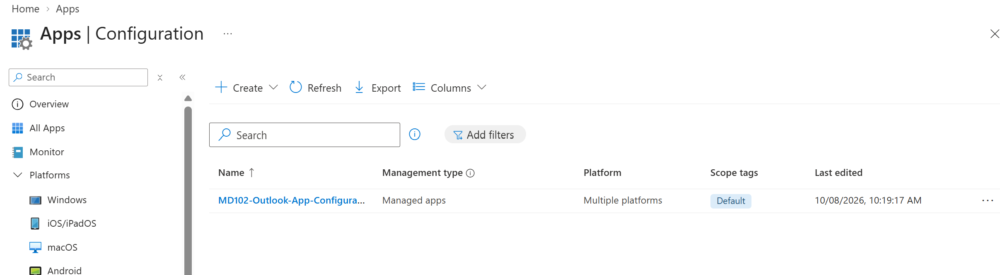

# Lab 12 - App Protection and App Configuration

## Objective

Configure Microsoft Intune app protection and app configuration capabilities for mobile application management scenarios.

This lab focuses on protecting organizational data in managed applications, integrating App Protection Policies with Conditional Access, and configuring Microsoft Outlook through an App Configuration Policy.

## Environment

| Component | Configuration |
|---|---|
| Management Platform | Microsoft Intune |
| Identity Platform | Microsoft Entra ID |
| Target Users | MD102-Intune-Users |
| Platform | iOS/iPadOS |
| Managed Application | Microsoft Outlook |

---

## 1. iOS/iPadOS App Protection Policy

An App Protection Policy named `MD102-iOS-App-Protection` was created for iOS/iPadOS.

The policy targeted Microsoft applications such as:

- Microsoft Outlook
- Microsoft Teams
- Microsoft OneDrive
- Microsoft Word
- Microsoft Excel

The policy was assigned to the `MD102-Intune-Users` group.

Key data protection settings included:

- Restricting organizational data transfer to policy-managed applications
- Blocking saving copies of organizational data to unmanaged locations
- Restricting copy and paste between managed and unmanaged applications
- Requiring organizational data encryption
- Blocking synchronization with unmanaged native applications
- Blocking printing of organizational data

Access requirements included:

- Requiring a PIN
- Using a minimum PIN length
- Allowing biometric authentication
- Requiring work or school account access

---

## 2. Conditional Access for App Protection

A Conditional Access policy named `MD102-Require-App-Protection` was created.

The policy targeted the `MD102-Intune-Users` group and mobile device platforms.

The grant control required an App Protection Policy before access to protected cloud resources could be granted.

The policy was configured in Report-only mode for safe validation.

---

## 3. App Configuration Policy

An App Configuration Policy named `MD102-Outlook-App-Configuration` was created for Microsoft Outlook.

The policy was configured for iOS/iPadOS and assigned to the `MD102-Intune-Users` group.

Outlook configuration settings were used to centrally manage selected application behavior.

This demonstrates how administrators can control application-specific settings independently from device configuration policies.

---

## 4. Managed Apps and Managed Devices

The differences between App Protection Policies and App Configuration Policies were reviewed.

App Protection Policies control how organizational data is protected inside supported applications.

App Configuration Policies control how supported applications are configured and behave.

These capabilities can be used together to provide secure mobile application management without requiring full device management in every scenario.

---

## Result

The following capabilities were implemented or reviewed:

- Created an iOS/iPadOS App Protection Policy
- Configured organizational data protection settings
- Configured application access requirements
- Assigned the App Protection Policy to users
- Created a Conditional Access policy requiring App Protection
- Configured the Conditional Access policy in Report-only mode
- Created an Outlook App Configuration Policy
- Assigned application configuration to managed users
- Reviewed managed app and managed device configuration scenarios

A physical iOS/iPadOS device was not available in the current lab environment, so device-side application behavior was not validated.

This lab demonstrates Microsoft Intune Mobile Application Management and Conditional Access integration.
