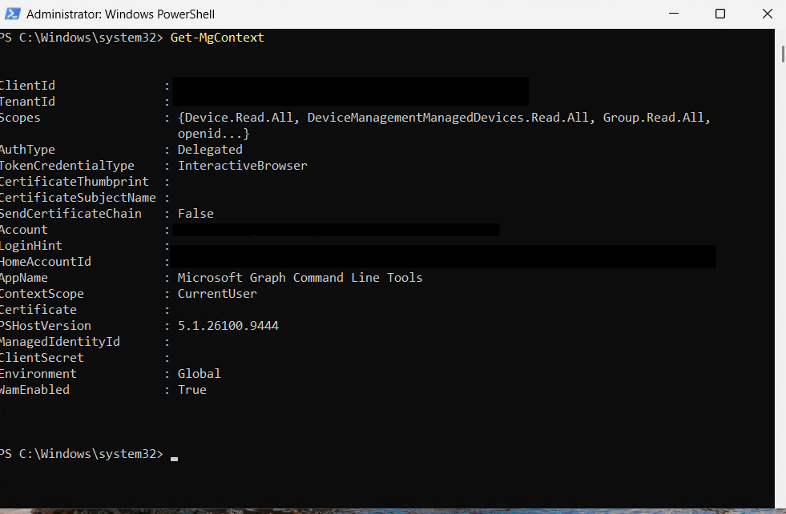
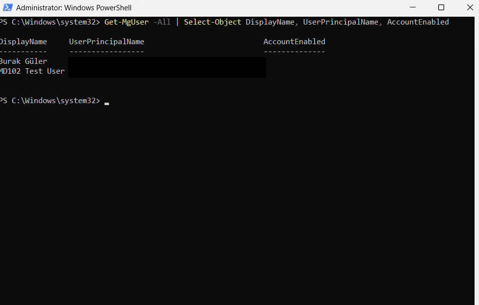
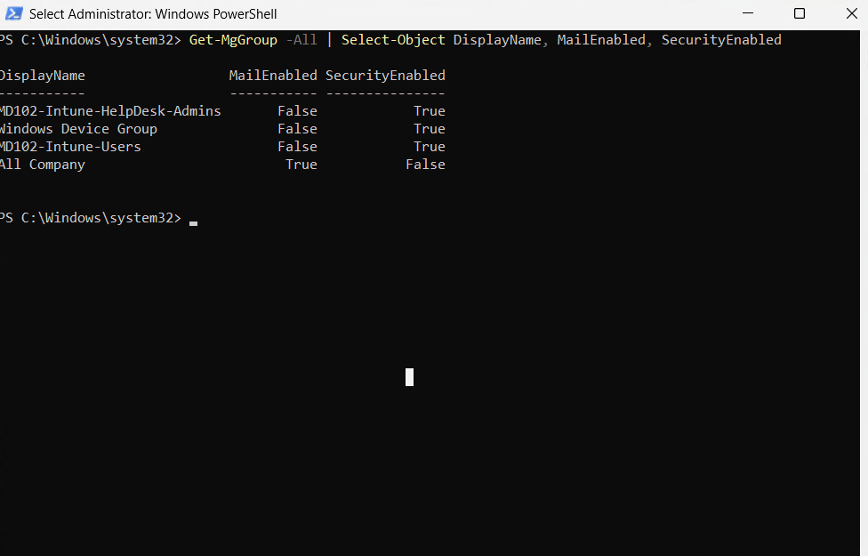
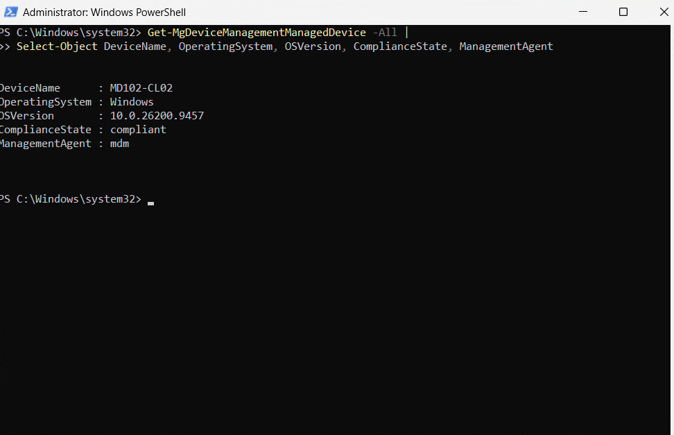

# Lab 13 - PowerShell and Microsoft Graph Automation

## Objective

Use PowerShell and Microsoft Graph to query and manage Microsoft Entra ID and Microsoft Intune resources.

This lab focuses on installing the Microsoft Graph PowerShell SDK, connecting to Microsoft Graph, querying Microsoft Entra ID objects, and retrieving Microsoft Intune managed device information.

## Environment

| Component | Configuration |
|---|---|
| Endpoint | MD102-CL02 |
| Operating System | Windows 11 |
| Automation Tool | Windows PowerShell |
| API Platform | Microsoft Graph |
| Identity Platform | Microsoft Entra ID |
| Device Management Platform | Microsoft Intune |

---

## 1. PowerShell and Microsoft Graph

PowerShell provides command-line automation and scripting capabilities.

Microsoft Graph provides a unified API for accessing Microsoft cloud services such as:

- Microsoft Entra ID
- Microsoft Intune
- Microsoft 365
- Microsoft Defender
- Microsoft Teams

The Microsoft Graph PowerShell SDK allows administrators to interact with Microsoft Graph directly from PowerShell.

---

## 2. Microsoft Graph PowerShell SDK

The Microsoft Graph PowerShell SDK was installed on `MD102-CL02`.

The execution policy was configured to allow trusted PowerShell modules to run.

Microsoft Graph authentication was then initialized using:

```powershell
Connect-MgGraph -Scopes "User.Read.All","Group.Read.All","Device.Read.All","DeviceManagementManagedDevices.Read.All"
```

The active Microsoft Graph session was verified using:

```powershell
Get-MgContext
```



---

## 3. Query Microsoft Entra ID Users

Microsoft Entra ID users were queried through Microsoft Graph PowerShell.

The following command was used:

```powershell
Get-MgUser -All | Select-Object DisplayName, UserPrincipalName, AccountEnabled
```

This demonstrates how Microsoft Graph can be used to retrieve user information without navigating through the Microsoft Entra admin center.



---

## 4. Query Microsoft Entra ID Groups

Microsoft Entra ID security and Microsoft 365 groups were queried through Microsoft Graph.

The following command was used:

```powershell
Get-MgGroup -All | Select-Object DisplayName, MailEnabled, SecurityEnabled
```

This allows administrators to retrieve group information for reporting and automation workflows.



---

## 5. Query Intune Managed Devices

Microsoft Intune managed devices were queried through Microsoft Graph PowerShell.

The following command was used:

```powershell
Get-MgDeviceManagementManagedDevice -All |
Select-Object DeviceName, OperatingSystem, OSVersion, ComplianceState, ManagementAgent
```

This provides managed device information directly from Microsoft Intune through Microsoft Graph.



---

## 6. Automation Use Cases

PowerShell and Microsoft Graph can be used to automate endpoint management tasks such as:

- User and group reporting
- Device inventory collection
- Compliance reporting
- Intune managed device reporting
- Bulk administration
- Policy and configuration automation
- Scheduled reporting
- Integration with other automation platforms

These capabilities reduce repetitive administrative work and support scalable endpoint management.

---

## 7. Security Copilot

Microsoft Security Copilot concepts were reviewed.

Topics included:

- Security Copilot workspaces
- Security Compute Units (SCUs)
- Permissions and roles
- Promptbooks
- Plugins
- Security investigations
- Intune integration
- Device performance analysis
- AI-assisted security recommendations

A Security Copilot workspace and SCUs were not provisioned in this lab to avoid unnecessary paid resource consumption.

---

## Result

The following automation capabilities were implemented or reviewed:

- Installed the Microsoft Graph PowerShell SDK
- Connected PowerShell to Microsoft Graph
- Queried Microsoft Entra ID users
- Queried Microsoft Entra ID groups
- Queried Microsoft Intune managed devices
- Reviewed PowerShell and Microsoft Graph automation scenarios
- Reviewed Microsoft Security Copilot concepts
- Reviewed Security Copilot permissions, plugins, prompts, and SCU concepts

This lab demonstrates how Microsoft Graph and PowerShell can be used to automate Microsoft Endpoint Management and Microsoft Entra ID administration.
