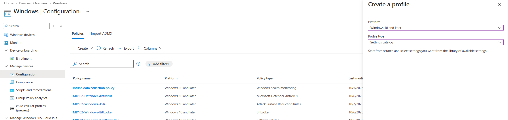
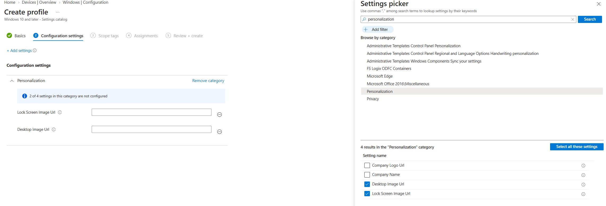
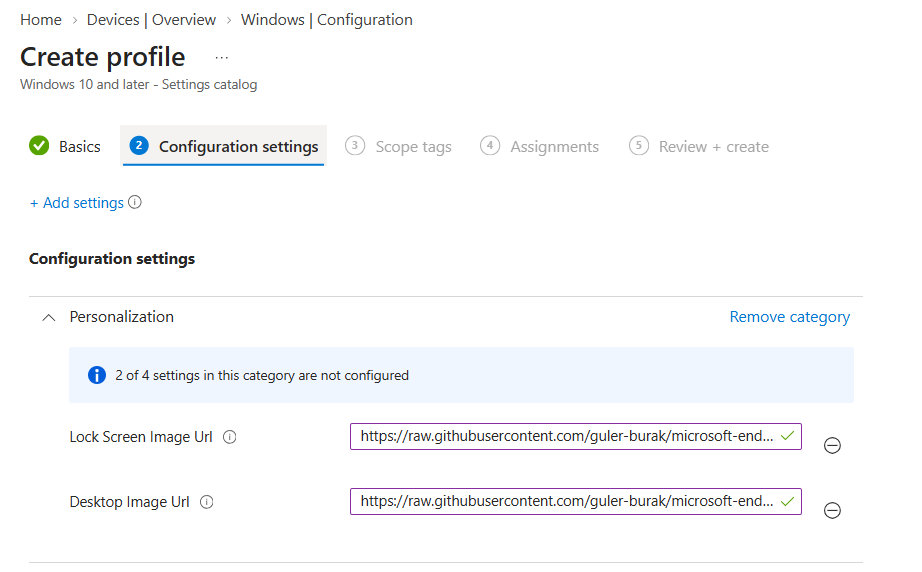
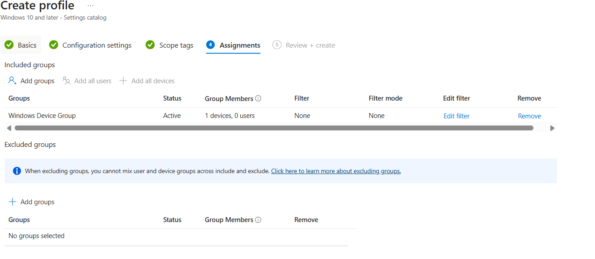
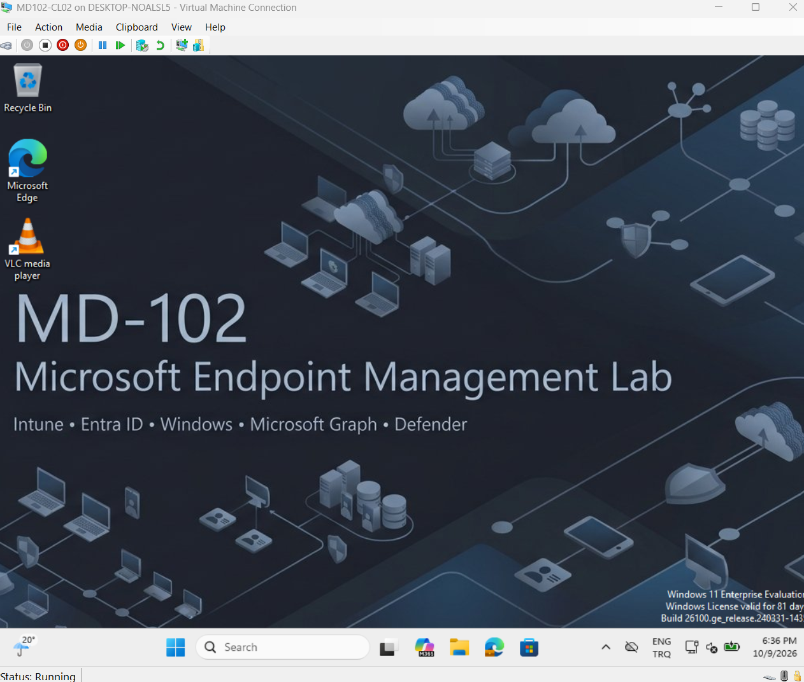
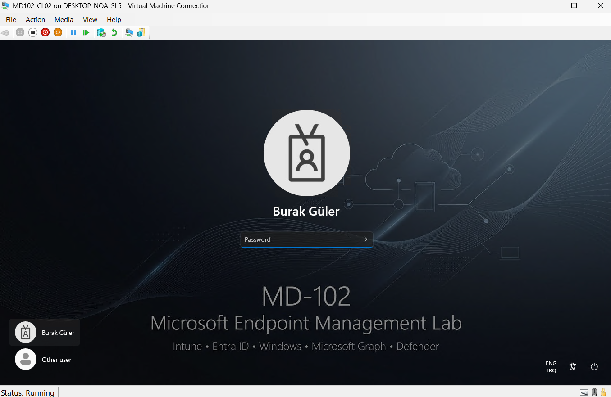

# Lab 14 - Windows Personalization & Corporate Branding

## Overview

This lab demonstrates how Microsoft Intune can be used to centrally manage Windows desktop and lock screen branding.

A Windows Settings Catalog policy was created and assigned to a managed device group. Corporate images hosted in the GitHub repository were delivered to a Microsoft Intune-managed Windows 11 endpoint.

The configuration was successfully validated on `MD102-CL02`.

---

## Objective

The objectives of this lab were to:

- Create a Windows personalization policy in Microsoft Intune
- Configure a centrally managed desktop wallpaper
- Configure a centrally managed Windows lock screen image
- Host corporate branding assets in a controlled repository
- Assign the configuration to managed Windows devices
- Validate the final configuration directly on the endpoint

---

## Environment

| Component | Configuration |
|---|---|
| Management Platform | Microsoft Intune |
| Endpoint | MD102-CL02 |
| Operating System | Windows 11 |
| Device Management | Microsoft Intune |
| Target Group | Windows Device Group |
| Profile Type | Settings Catalog |
| Policy | MD102-Windows-Personalization |
| Image Hosting | GitHub |
| Delivery Method | HTTPS / Raw GitHub content |

---

## 1. Create the Personalization Policy

A new Windows configuration profile was created in Microsoft Intune.

Configuration:

- Platform: `Windows 10 and later`
- Profile type: `Settings catalog`
- Policy name: `MD102-Windows-Personalization`



---

## 2. Define the Policy

The policy was created specifically to manage Windows corporate branding settings.

The configuration profile was named:

`MD102-Windows-Personalization`

This naming convention makes the purpose and target platform of the policy immediately identifiable to administrators.



---

## 3. Configure Desktop and Lock Screen Images

The following Settings Catalog values were configured under Windows Personalization:

- `Desktop Image Url`
- `Lock Screen Image Url`

The images were stored in the GitHub repository and accessed by the managed endpoint through direct HTTPS URLs.

Using centrally hosted image files allows administrators to change the corporate branding source without manually copying files to individual endpoints.



---

## 4. Assign the Policy

The personalization policy was assigned to:

`Windows Device Group`

This allows the configuration to be automatically delivered to Windows devices that are members of the group.

Device group assignment also enables administrators to manage branding centrally without configuring each endpoint individually.



---

## 5. Desktop Wallpaper Validation

After the Microsoft Intune synchronization completed, the corporate desktop wallpaper was successfully applied to `MD102-CL02`.

The endpoint received the branding configuration without requiring the image to be manually copied or configured by the user.



---

## 6. Lock Screen Validation

The Windows lock screen was also validated after the personalization policy was applied.

The configured corporate lock screen image was successfully delivered through Microsoft Intune.



---

## Architecture

The configuration uses the following management flow:

```text
GitHub Repository
       |
       | HTTPS
       v
Microsoft Intune
       |
       | Settings Catalog Policy
       v
Windows Device Group
       |
       v
MD102-CL02
       |
       +--> Corporate Desktop Wallpaper
       |
       +--> Corporate Lock Screen
```

---

## Enterprise Use Case

Centralized personalization policies are useful in enterprise environments for:

- Corporate branding
- Standardized employee desktops
- Security or compliance messaging
- Company announcements
- Help desk contact information
- Device ownership identification
- Consistent endpoint configuration

The same configuration can be assigned to hundreds or thousands of managed Windows devices through Microsoft Intune.

---

## Skills Demonstrated

This lab demonstrates hands-on experience with:

- Microsoft Intune Settings Catalog
- Windows configuration profiles
- Microsoft Entra device groups
- Device-based policy assignment
- HTTPS-hosted configuration resources
- Windows personalization CSP settings
- Intune policy synchronization
- Endpoint configuration validation
- GitHub-based asset management

---

## Result

The Windows personalization configuration was successfully implemented and validated.

The completed solution provides:

- Centrally managed desktop wallpaper
- Centrally managed lock screen image
- Group-based policy targeting
- Cloud-hosted branding resources
- Successful deployment to a managed Windows 11 endpoint

This lab demonstrates a practical enterprise use case for Microsoft Intune configuration management beyond the standard MD-102 course exercises.
